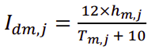
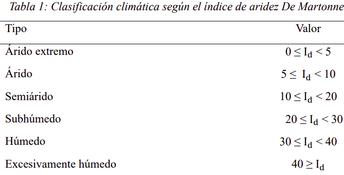

```{r, warning=FALSE, message=FALSE}
library(tmap)
library(rcartocolor)
library(sf)
library(raster)
library(dplyr)
library(RColorBrewer)
library(tidyverse)
```


# **Resumen**

<div style = "text-align: justify"> Lima Metropolitana y Callao están ubicadas dentro de un desierto al oeste del continente sudamericano, se extiende en las coordenadas UTM: Norte 8 720 000 - 8 620 000 y Este 260000-325000. Por su latitud geográfica, el clima debería ser tropical y lluvioso, pero a raíz de la cordillera de los andes, el mar frío y el anticiclón del Pacífico Sur, forma una capa casi permanente de nubes estratos a lo largo del año, modificándose así el clima. Estas condiciones particulares propician condiciones para el funcionamiento de ecosistemas diferentes al del tradicional desierto, siendo lomas y humedales los más destacables. Además, se distingue una diferencia entre el desierto del norte peruano que sí es más seco y cálido al del centro y sur. Predominantemente la topografía del área estudiada es llana con presencia de estribaciones andinas; se observa la presencia de flora permanente y estacional con grandes periodos de dormancia; la fauna presenta gran cantidad de aves y reptiles, con poca variabilidad de mamíferos. Para estimar los índices bioclimáticos se realizó la extracción de los datos de biodiversidad del MINAM y SENACE, las variables climáticas del WorldClim y el modelo de elevación digital de la NASA. Además, la metodología consistió en aplicar estadísticas de zonas para obtener los promedios anuales, también se realizó geoprocesamiento y álgebra de ráster, para generar las tablas y los mapas de estos índices. Finalmente, se comprobó que el área estudiada se clasifica climáticamente como continental y árida, correlacionándose con la flora-fauna del ecosistema predominante el cual es el desierto costero, dejando a un lado la abundancia estacional de las lomas y diversidad de especies en los humedales. Se incluyen los impactos por los que muchas especies de estas áreas están siendo desplazadas, destacando los cambios en los usos del suelo y procesos mal planificados de urbanización. Palabras clave: fauna; flora; índices bioclimáticos; Lima Metropolitana y Callao.</div>

# **Introducción**

<div style = "text-align: justify"> La ciudad de Lima está ubicada en la costa central del Perú y es la segunda ciudad con mayor densidad de población en un desierto, luego de El Cairo. Presenta características únicas en flora y fauna debido a una suerte de diferentes factores. Por su situación latitudinal, Lima corresponde a una zona tropical de abundantes precipitaciones por su cercanía al Ecuador; sin embargo, la ausencia de estas se debe a la presencia del Anticiclón del Pacífico Sur (Espinoza et al., 2010; Pinche, 1986), la Corriente Peruana o Corriente de Humboldt (Pinche, 1986), en conjugación con la Cordillera de los Andes. (Mostacero León et al., 2007) Estas condiciones particulares de nuestra costa centro y sur crean las condiciones necesarias para la formación de nubes estratos en el invierno que originan unos ambientes propios como lo son las lomas. También, al estar localizada en medio de un desierto, el agua tiene una gran importancia y para ello contamos con tres ríos que cruzan nuestra ciudad, los cuales significan una fuente de agua continua, siendo el Rímac el de mayor valor (Urban Harvest, 2007). Además, estos forman valles fértiles y tienen cierta contribución, junto al mar, en otro ecosistema: los humedales. Lamentablemente, debido a las acciones antrópicas directas e indirectas, estas áreas con gran contenido genético de especies son escasamente estudiadas, inclusive día a día se van reduciendo ante los ojos de una autoridad muchas veces incompetente y negligente en el ámbito de conservación. 

El objetivo de este trabajo es i) determinar el ambiente fitoclimático del clima de Lima Metropolitana y el Callao, a través del análisis de índices bioclimáticos, ii) mostrar si existe relación entre el resultado de estos índices con la distribución de especies de flora y fauna presentes en ecosistemas del área de estudio y iii) mostrar las formas de vida adaptadas a estos territorios, la intrusión humana en estos espacios y cómo afectan a la diversidad biológica. De esta manera, se tratará de contribuir a estudios mucho más analíticos que contribuyan, a la larga, a preservar los ecosistemas, dentro y fuera de estas urbanizadas provincias del Perú.</div>

# **1. Antecedentes**
# **2. Materiales**
## **2.1. Área de estudio**
## **2.2. Biodiversidad**
## **2.3. Variables climáticas**

<div style = "text-align: justify">Para la obtención de las variables climáticas se utilizó el conjunto de datos CRU TS-4.03 (Serie de tiempo grillada de la Unidad de Investigación Climática versión 4.03) producido por la Universidad de East Anglia, en Reino Unido. El CRU TS-4.03 está basado en datos de observación actualizados periódicamente a partir de varias fuentes mensuales principales: los mensajes CLIMAT, intercambiados internacionalmente entre países de la OMM (Organización Meteorológica Mundial), se obtienen como archivos con control de calidad a través de la Met Office del Reino Unido y los resúmenes de MCDW (Datos climáticos mensuales del mundo) son obtenidos de la Administración Nacional Oceanográfica y Atmosférica de los Estados Unidos (NOAA) a través de su Centro Nacional de Datos Climáticos (NCDC) (Harris et al., 2020). Los datos de observación provenientes de estas fuentes principales son procesados y luego interpolados utilizando ponderación de distancia angular (ADW) para obtener datos en cuadriculas de resolución de 0.5º latitud y 0.5º de longitud, las cuales cubren todo el globo terrestre a excepción de la Antártida. Cabe resaltar que la data disponible en WorldClim, en donde se extrajeron las variables, se encuentra en una resolución de 2.5 min por cuadrícula, lo que resulta un área de ~ 21.1 km2 . Para ello se realizó un aumento de resolución (downscaling) usando la metodología para la corrección de sesgos empleada para la base de datos WorldClim 2 (Fick y Hijmans, 2017). Este conjunto final de datos nos proporciona un registro histórico mensual de variables climáticas desde 1960 hasta el 2018. Las variables disponibles son la temperatura mínima media (ºC), la temperatura máxima media y la precipitación total (mm), las cuales serán usadas en el período asignado de cinco años: desde el 2014 hasta el 2018.</div>

### **2.3.1 Precipitación**

```{r warning=FALSE, cache=FALSE, eval=FALSE, fig.align='center'}
# Listar datos de precipitación
list_img <- list.files('Data/wc2.1_2.5m_prec_2010-2018/', full.names = TRUE, pattern = "*.tif")

# Lectura de un raster
PrecJan2010 <-  raster(list_img[1])

# Identificar el SRC y propiedades de la imagen
# projection(PrecJan2010)
# extent(PrecJan2010)

# Filtramos Lima
prov <- st_read('Materiales/Provincias.gpkg', quiet = TRUE) # plot(st_geometry(prov), axes = T)
# st_crs(prov)$epsg # podemos ver su EPSG

# names(prov) # ver las cabeceras o campos (esto lo hacemos para filtrar)
Lima <- prov[prov$PROVINCIA == "LIMA",] # La necesitamos para cortar nuestro área de estudio. 

Lima <- st_transform(Lima, projection(PrecJan2010)) # transformamos, por siaca, ya que tanto vector como raster                               # podrían tener crs diferente si es asi no podríamos realizar geoprocesamientos.
                                                                          
# Cortar con crop: Ya que tenemos el raster y el poligono para el área, esto para reducir el procesamiento
PLJ2010 <- PrecJan2010 %>% crop(Lima, snap = 'out')
# plot(PLJ2010, axes = T)
# plot(Lima, add = T)


pz1 <- tm_shape(PLJ2010) + tm_raster(style = "cont", palette = "PuBu", title = "precipitación [mm]") + 
  tm_shape(Lima) + tm_borders(lwd = 2) + # tmaptools::palette_explorer()
  tm_layout(main.title = "Precipitación \nEnero del 2010", bg.color = "lightblue", scale = 1,
            legend.show = TRUE, legend.outside = TRUE, legend.outside.position = "right") +
  tm_text("PROVINCIA", size = 0.5) +
  tm_compass(position = c("RIGHT", "TOP"), size = 2.5) + 
  tm_scale_bar(position = c(0.05, 0.03))
pz1
  
```

### **2.3.2 Temperatura Máxima**

```{r warning=FALSE, cache=FALSE, eval=FALSE, fig.align='center'}
# Listar datos de tmax
list_img <- list.files('Data/wc2.1_2.5m_tmax_2010-2018/', full.names = TRUE, pattern = "*.tif")

# Lectura de un raster
TmaxJan2010 <-  raster(list_img[1])

# Identificar el SRC y propiedades de la imagen
# projection(TmaxJan2010)
# extent(TmaxJan2010)

# Filtramos Lima
prov <- st_read('Materiales/Provincias.gpkg', quiet = TRUE) # plot(st_geometry(prov), axes = T)
st_crs(prov)$epsg # podemos ver su EPSG

# names(prov) # ver las cabeceras o campos (esto lo hacemos para filtrar)
Lima <- prov[prov$PROVINCIA == "LIMA",] # La necesitamos para cortar nuestro área de estudio. 

Lima <- st_transform(Lima, projection(TmaxJan2010)) # transformamos, por siaca, ya que tanto vector como raster                               # podrían tener crs diferente si es asi no podríamos realizar geoprocesamientos.
                                                                          
# Cortar con crop: Ya que tenemos el raster y el poligono para el área, esto para reducir el procesamiento
TXJ2010 <- TmaxJan2010 %>% crop(Lima, snap = 'out')
# plot(PLJ2010, axes = T)
# plot(Lima, add = T)


pz1 <- tm_shape(TXJ2010) + tm_raster(style = "cont", palette = "YlOrRd", title = "TempMax [°C]") + 
  tm_shape(Lima) + tm_borders(lwd = 2) + # tmaptools::palette_explorer()
  tm_layout(main.title = "Temperatura Máxima \nEnero del 2010", bg.color = "lightblue", scale = 1,
            legend.show = TRUE, legend.outside = TRUE, legend.outside.position = "right") +
  tm_text("PROVINCIA", size = 0.5) +
  tm_compass(position = c("RIGHT", "TOP"), size = 2.5) + 
  tm_scale_bar(position = c(0.05, 0.03))

pz1
```

### **2.3.3 Temperatura Mínima**

```{r warning=FALSE, cache=FALSE, eval=FALSE, fig.align='center'}
# Listar datos de tmin
list_img <- list.files('Data/wc2.1_2.5m_tmin_2010-2018/', full.names = TRUE, pattern = "*.tif")

# Lectura de un raster
TminJan2010 <-  raster(list_img[1])

# Identificar el SRC y propiedades de la imagen
# projection(TminJan2010)
# extent(TminJan2010)

# Filtramos Lima
prov <- st_read('Materiales/Provincias.gpkg', quiet = TRUE) # plot(st_geometry(prov), axes = T)
# st_crs(prov)$epsg # podemos ver su EPSG

# names(prov) # ver las cabeceras o campos (esto lo hacemos para filtrar)
Lima <- prov[prov$PROVINCIA == "LIMA",] # La necesitamos para cortar nuestro área de estudio. 

Lima <- st_transform(Lima, projection(TminJan2010)) # transformamos, por siaca, ya que tanto vector como raster                               # podrían tener crs diferente si es asi no podríamos realizar geoprocesamientos.
                                                                          
# Cortar con crop: Ya que tenemos el raster y el poligono para el área, esto para reducir el procesamiento
TMIJ2010 <- TminJan2010 %>% crop(Lima, snap = 'out')
# plot(PLJ2010, axes = T)
# plot(Lima, add = T)


pz1 <- tm_shape(TMIJ2010) + tm_raster(style = "cont", palette = "RdPu", title = "TempMin [°C]") + 
  tm_shape(Lima) + tm_borders(lwd = 2) + # tmaptools::palette_explorer()
  tm_layout(main.title = "Temperatura Mínima \nEnero del 2010", bg.color = "lightblue", scale = 1,
            legend.show = TRUE, legend.outside = TRUE, legend.outside.position = "right") +
  tm_text("PROVINCIA", size = 0.5) +
  tm_compass(position = c("RIGHT", "TOP"), size = 2.5) + 
  tm_scale_bar(position = c(0.05, 0.03))

pz1
```

### **2.3.4 Temperatura Media**

```{r warning=FALSE, cache=FALSE, eval=FALSE, fig.align='center'}
TMNJ2010 <- (TMIJ2010 + TXJ2010) / 2 # semisuma

# ploteo
pz1 <- tm_shape(TMNJ2010) + tm_raster(style = "cont", palette = "YlGn", title = "TempMean [°C]") + 
  tm_shape(Lima) + tm_borders(lwd = 2) + # tmaptools::palette_explorer()
  tm_layout(main.title = "Temperatura Media \nEnero del 2010", bg.color = "lightblue", scale = 1,
            legend.show = TRUE, legend.outside = TRUE, legend.outside.position = "right") +
  tm_text("PROVINCIA", size = 0.5) +
  tm_compass(position = c("RIGHT", "TOP"), size = 2.5) + 
  tm_scale_bar(position = c(0.05, 0.03))

pz1
```


### **2.3.5 Guardado de 2010 - 2018**


```{r eval=FALSE, echo = FALSE, message = FALSE}
# Listar datos de tmin
list_img <- list.files('Data/wc2.1_2.5m_tmin_2010-2018/', full.names = TRUE, pattern = "*.tif")[1:12]
param <- c('tmin', 'tmax', 'prec')
rt <- raster(list_img[1])
prec <- 0
tmin <- 0
tmax <- 0

# Area de cortado (crop)
prov <- st_read('Materiales/Provincias.gpkg', quiet = TRUE) # plot(st_geometry(prov), axes = T)
Lima <- prov[prov$PROVINCIA == "LIMA",] # La necesitamos para cortar nuestro área de estudio. 
Lima <- st_transform(Lima, projection(rt))
list_rast <- list()

for (j in param) {
  # print(j)
  substr(list_img, 17, 20) = j
  substr(list_img, 44, 47) = j
  for (i in 1:length(list_img)) {
    # print(i)
    rast  = raster(list_img[i]) %>% crop(Lima, snap = 'out')
    # writeRaster(rast, paste0('Data/wc2.1_2.5m_', j, '_2010-2018/Crop/Crop_', substr(list_img[i], 33, 59)))
    list_rast[[i]] = rast
  }
  if (j == "prec") {
    prec = sum(raster::stack(list_rast))
  } 
  if (j == "tmax") {
    tmax = raster::stack(list_rast)
  }
  if (j == "tmin") {
    tmin = raster::stack(list_rast)
  }
}
```

```{r eval=FALSE, echo = FALSE}
srtm = raster(system.file("raster/srtm.tif", package = "spDataLarge"))
zion = st_read(system.file("vector/zion.gpkg", package = "spDataLarge"))
zion = st_transform(zion, projection(srtm))
srtm_cropped = crop(srtm, zion)
srtm_masked = mask(srtm, zion)
srtm_inv_masked = mask(srtm, zion, inverse = TRUE)


terrain_colors = carto_pal(7, "TealRose")
pz1 = tm_shape(srtm) + tm_raster(palette = terrain_colors, legend.show = FALSE, style = "cont") + 
  tm_shape(zion) + tm_borders(lwd = 2) + 
  tm_layout(main.title = "A. Original")
pz2 = tm_shape(srtm_cropped) + tm_raster(palette = terrain_colors, legend.show = FALSE, style = "cont") + 
  tm_shape(zion) + tm_borders(lwd = 2) + 
  tm_layout(main.title = "B. Crop")
pz3 = tm_shape(srtm_masked) + tm_raster(palette = terrain_colors, legend.show = FALSE, style = "cont") + 
  tm_shape(zion) + tm_borders(lwd = 2) + 
  tm_layout(main.title = "C. Mask")
pz4 = tm_shape(srtm_inv_masked) + tm_raster(palette = terrain_colors, legend.show = FALSE, style = "cont") + 
  tm_shape(zion) + tm_borders(lwd = 2) + 
  tm_layout(main.title = "D. Inverse mask")
tmap_arrange(pz1, pz2, pz3, pz4, ncol = 4)
```

```{r eval=FALSE, echo = FALSE}
"IDAHO_EPSCOR/TERRACLIMATE"

# La Region de interes es anta, pero puede variar según sigamos el proceso

Cajamarca <- st_read('Materiales/Cajamarca.gpkg') %>% st_geometry() %>% sf_as_ee()
Cajamarca_box <- st_read('Materiales/Cajamarca.gpkg') %>% st_make_grid(n = 1) %>% sf_as_ee()

ndvi_composite <- ee$ImageCollection("IDAHO_EPSCOR/TERRACLIMATE")$
  select('tmmn')$
  filter(ee$Filter$date('2000-01-01', '2015-12-31'))#$
  # filterBounds(ee_roi1)


df <- ee_get_date_ic(ndvi_composite)
for (i in 1:length(df$id)) {
  cajamarca_tmmn <- ee$Image("IDAHO_EPSCOR/TERRACLIMATE/200001")$
    select('tmmn')$
    clip(Cajamarca)
}


Cajamarca_dem <- ee$Image("IDAHO_EPSCOR/TERRACLIMATE/200001")$#$clip(Cajamarca)
  select('tmmn')$
  clip(Cajamarca_box)

# dem_caja_raster <- ee_as_raster(Cajamarca_dem, Cajamarca)
# writeRaster(dem_caja_raster, 'RasterData/SRTM_90/CajamarcaSRTM.tif')
# viz <- list(min= 100,
#             max = 4500,
#             palette = cpt(pal = 'gmt_GMT_dem1',n = 10))

Map$centerObject(Cajamarca, zoom = 10)
Map$addLayer(Cajamarca_dem,visParams = viz, name = "DEM_SRTM_V4")


# +
#   Map$addLayer(Cutervo, name = "Cutervo") +
#   Map$addLayer(Cajamarca, name = "Cajamarca")


# ndvi_composite <- ee$ImageCollection("MODIS/006/MOD13Q1")$
#   filter(ee$Filter$date('2016-01-01', '2016-12-31'))$
#   map(mod13Q1_clean) # Descarga de estos

# ndvi_composite_sc <- ee$ImageCollection("MODIS/006/MOD13Q1")$
#   filter(ee$Filter$calendarRange(1, field = "month"))$
#   filter(ee$Filter$date('2016-01-01', '2016-12-31'))$
#   mean() # Para ploteo no sirve


# Color para el segundo NDVI
# ndviParams <- list(palette = c(
#   "#d73027", "#f46d43", "#fdae61",
#   "#fee08b", "#d9ef8b", "#a6d96a",
#   "#66bd63", "#1a9850"
# ))

maximumTemperatureVis = list(min =-300.0,max: 300.0,
  palette = ('1a3678', '2955bc', '5699ff', '8dbae9', 'acd1ff', 'caebff', 'e5f9ff',
    'fdffb4', 'ffe6a2', 'ffc969', 'ffa12d', 'ff7c1f', 'ca531a', 'ff0000',
    'ab0000'))


# Ploteo de la media de los años
Map$setCenter(ee_roi1, zoom = 10)
Map$addLayers(eeObject = ndvi_composite) 


# +
#   Map$addLayer(ee_roi1, name = "Cajamarca")
# 

# Download raster
# ee_imagecollection_to_local(ic = ndvi_composite, 
#                             region = ee_roi, 
#                             dsn = "MODQ1/Filtrado/NDVI_MOD13Q1")
```


## **2.4. Modelo de elevación digital**
# **3. Métodos**
## **3.1. Aplicación de los índices bioclimáticos**
### **3.1.1. Indices termopluviométricos**
#### **3.1.1.2 Indice de Martonne**

##### **Ecuación**

```{r echo = FALSE, fig.align='center', out.width="50%"}

```

##### **Tabla de valores**

```{r echo = FALSE, fig.align='center', out.width="50%"}

```

##### **Para 2010**

```{r warning=FALSE, cache=FALSE, eval=FALSE, fig.align='center'}

list_img <- list.files('Data/wc2.1_2.5m_tmin_2010-2018/Crop/', full.names = TRUE, pattern = "*.tif")[1:12]
param <- c('tmin', 'tmax', 'prec')
rt <- raster(list_img[1])
prec <- 0
tmin <- 0
tmax <- 0

for (j in param) {
  # print(j)
  substr(list_img, 17, 20) = j
  substr(list_img, 54, 57) = j
  for (i in 1:length(list_img)) {
    # print(i)
    rast  = raster(list_img[i])
    list_rast[[i]] = rast
  }
  if (j == "prec") {
    prec = sum(raster::stack(list_rast))
  } 
  if (j == "tmax") {
    tmax = raster::stack(list_rast)
  }
  if (j == "tmin") {
    tmin = raster::stack(list_rast)
  }
}


# Operacion para martonne
tmean <- mean((tmax + tmin) / 2) # Temperatura media
Martonne2010 <- prec / (tmean + 10) # Indice de Martonne

# max(getValues(Martonne2010), na.rm = TRUE)
# min(getValues(Martonne2010), na.rm = TRUE)

# Filtro Martonne
Martonne2010[Martonne2010 < 5] = 1 # arido extremo
Martonne2010[Martonne2010 >= 5 & Martonne2010 < 10] = 2 # arido
Martonne2010[Martonne2010 >= 10 & Martonne2010 < 20] = 3 # semiarido
Martonne2010[Martonne2010 >= 20 & Martonne2010 < 30] = 4 # subhumedo
Martonne2010[Martonne2010 >= 30 & Martonne2010 < 40] = 5 # humedo
Martonne2010[Martonne2010 >= 40] = 6 # excesivamente humedo


pz1 <- tm_shape(Martonne2010) +
  tmap_options(inner.margins = NA) +
  tm_raster(style = "cat", palette = c("#ffeda0", "#feb24c", "#f03b20"),
            title = "Clima", labels = c("árido extremo","árido","semiárido")) + # breaks = c("árido extremo","árido","semiárido")
  tm_shape(Lima) + tm_borders(lwd = 2) + 
  tm_layout(main.title = "ÍNDICE DE MARTONNE \n2010", bg.color = "lightblue", scale = 1,
            legend.show = TRUE, legend.outside = TRUE, legend.outside.position = "right",
            main.title.size = 1, fontface = 2) +
  tm_text("PROVINCIA", size = 0.5) +
  tm_compass(position = c("RIGHT", "TOP"), size = 2.5) + 
  tm_scale_bar(position = c(0.05, 0.03))

pz1
```

##### **Para 2010 - 2018**

```{r warning=FALSE, cache=FALSE, eval=TRUE, fig.align='center', message = FALSE}
# Area de cortado (crop)
prov <- st_read('Materiales/Provincias.gpkg', quiet = TRUE) # plot(st_geometry(prov), axes = T)
Lima <- prov[prov$PROVINCIA == "LIMA",] # La necesitamos para cortar nuestro área de estudio.
Lima <- st_transform(Lima, crs = 4623)

list_img <- list.files('Data/wc2.1_2.5m_tmin_2010-2018/Crop/', full.names = TRUE, pattern = "*.tif$")

param <- c('tmin', 'tmax', 'prec') # parametros para cada carpeta 
rt <- raster(list_img[1])
raster()
prec_t <- 0
tmin_t <- 0
tmax_t <- 0
list_rast <- list()
prec_sub <- list()
tmin_sub <- list()
tmax_sub <- list()

for (j in param) {
  x = 1 # posiciones
  y = 1
  # print(j)
  substr(list_img, 17, 20) = j 
  substr(list_img, 53, 56) = j # for linux substr(list_img, 54, 57)
  for (i in 1:length(list_img)) {
    # print(i)
    list_rast[[i]] = raster(list_img[i]) # recien se metio dentro de una lista
  }
  if (j == "prec") {
    prec_t = list_rast
    while (x < length(prec_t)) {
      if(x == 1) {
        prec_sub[[y]] = raster::stack(prec_t[x:(x+11)])
        x = x + 11
        y = y + 1
      } else {
        prec_sub[[y]] = raster::stack(prec_t[(x+1):(x+12)])
        x = x + 12
        y = y + 1
      }
    }
  } 
  if (j == "tmax") {
    tmax_t = list_rast
    while (x < length(tmax_t)) {
      if(x == 1) {
        tmax_sub[[y]] = raster::stack(tmax_t[x:(x+11)])
        x = x + 11
        y = y + 1
      } else {
        tmax_sub[[y]] = raster::stack(tmax_t[(x+1):(x+12)])
        x = x + 12
        y = y + 1
      }
    }
  }
  if (j == "tmin") {
    tmin_t = list_rast
    while (x < length(tmin_t)) {
      if(x == 1) {
        tmin_sub[[y]] = raster::stack(tmin_t[x:(x+11)])
        x = x + 11
        y = y + 1
      } else {
        tmin_sub[[y]] = raster::stack(tmin_t[(x+1):(x+12)])
        x = x + 12
        y = y + 1
      }
    }
  }
}

# Creacion del indice martonne
n <- raster::stack(sapply(tmax_sub, mean)) # Promedio anual
m <- raster::stack(sapply(tmin_sub, mean))
TMEAN <- (n + m) / 2 # Promedio entre temperatura maxima y minima´
PREC <- raster::stack(sapply(prec_sub, function(x){return(sum(x))})) # Suma anual de precipitacion
Martonne <- PREC / (TMEAN + 10)
names(Martonne) <- c("Año2010", "Año2011", "Año2012", "Año2013", "Año2014",
                     "Año2015", "Año2016", "Año2017", "Año2018") 
Martonne <- disaggregate(Martonne, fact = 100, method = "bilinear")

# Filtro martonne
Martonne[Martonne < 5] = 1 # arido extremo
Martonne[Martonne >= 5 & Martonne < 10] = 2 # arido
Martonne[Martonne >= 10 & Martonne < 20] = 3 # semiarido
Martonne[Martonne >= 20 & Martonne < 30] = 4 # subhumedo
Martonne[Martonne >= 30 & Martonne < 40] = 5 # humedo
Martonne[Martonne >= 40] = 6 # excesivamente humedo


# # Guardado
# 
# for (i in 1:9) {
#   print(i)
#   writeRaster(Martonne[[i]], paste0('Indices_Lima/raster/crop/Martonne', as.character(i+2009),'.tif'))
#   writeRaster(mask(Martonne[[i]], Lima),
#               paste0('Indices_Lima/raster/mask/Martonne', as.character(i+2009),'.tif'))
# }
# 
# writeRaster(Martonne, 'Indices_Lima/raster/crop/MultiTimeMartonne.tif') # guardado
# writeRaster(mask(Martonne, Lima), 'Indices_Lima/raster/mask/MulTMartonne.tif')

# Ploteo
pz1 <- tm_shape(Martonne) + # se puede ingresar solo uno
  tm_raster(style = "cat", palette = c("#ffffb2", "#fed976", "#feb24c", "#fd8d3c", "#f03b20", "#bd0026"),
            title = "Clima", labels = c("árido extremo","árido","semiárido", 
                                        "subhúmedo", "húmedo", "muy húmedo")) + 
  tm_facets(ncol = 3, nrow = 3) + # Para decidir la la matriz de visualizacion
  tm_shape(Lima) + 
  tm_borders(col = "black", lwd = 1) + 
  tm_layout(main.title = "ÍNDICE DE MARTONNE \n2010 - 2018", bg.color = "lightblue",
            legend.show = TRUE, main.title.position = 0.1, outer.bg.color = "#bcbddc") +
  tm_legend(legend.outside = TRUE, legend.outside.position = "right",
            main.title.size = 1, fontface = 2)+
  tm_text("PROVINCIA", size = 0.5) +
  tm_compass(position = c("RIGHT", "TOP"), size = 1) + 
  tm_scale_bar(position = c(0.05, 0.03))

pz1
```


### **3.1.2. Índices de continentalidad**
### **3.1.3. Diagrama ombrotérmico de Gaussen**
## **3.2. Estadísticas de zonas**
## **3.3. Geoprocesamiento y álgebra de mapas**
### **3.3.1. Geoprocesamiento**
### **3.3.2. Álgebra de mapas**
# **4. Resultados**
## **4.1. Índice de aridez de Martonne**
## **4.2. Índice Termopluviométrico Dantin-Revenga**
## **4.3. Índice de Continentalidad compensado por la latitud Currey**
## **4.4. Índice de Continentalidad compensado por latitud y altitud de Daget**
# **5. Conclusiones**


